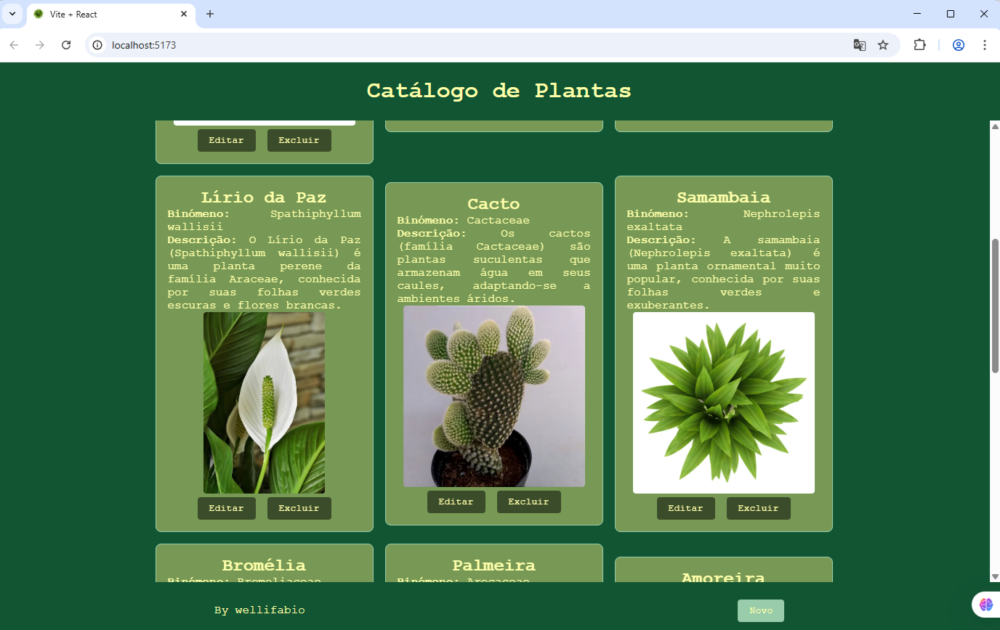

# Catálogo de plantas - Full Stack
Projeto simples de exemplo para cadastro de plantas.

## Tecnologias utilizadas

### Back-end
- Node.js
- Express
- Prisma
    - Seed
- XAMPP
    - MySQL

### Front-end
- React
- Vite
- Axios

## Passos para testar
1. Inicie o servidor da API (Siga as instruções em `./api/README.md`)
2. Inicie o aplicativo front-end (Siga as instruções em `./web/README.md`)
3. Acesse `http://localhost:5173` no navegador

## Screenshots
- Testes da API com Insomnia

- Testes do Front-end no Navegador

- Responsividade
