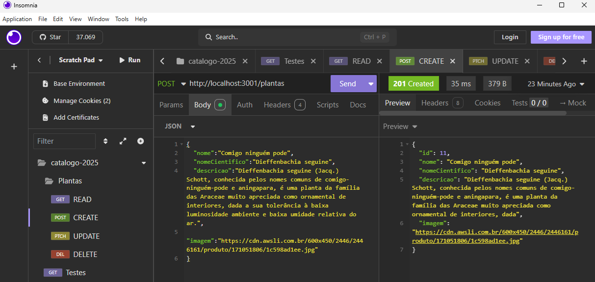

# API Catálogo de plantas
API simples de exemplo de um catálogo de plantas

## Tecnologias utilizadas
- Node.js
- Express
- Prisma
    - Seed
- XAMPP
    - MySQL

## Passos para execução
1. Clonar o repositório e acessar a pasta `./api`
2. Instalar as dependências `npm install`
3. Inicie o SGBD, abrindo o XAMPP e iniciando o MySQL
4. Executar as migrações e semeaduras `npx prisma migrate dev --name init`
5. Iniciar o servidor `npm run dev`

## Screenshots
