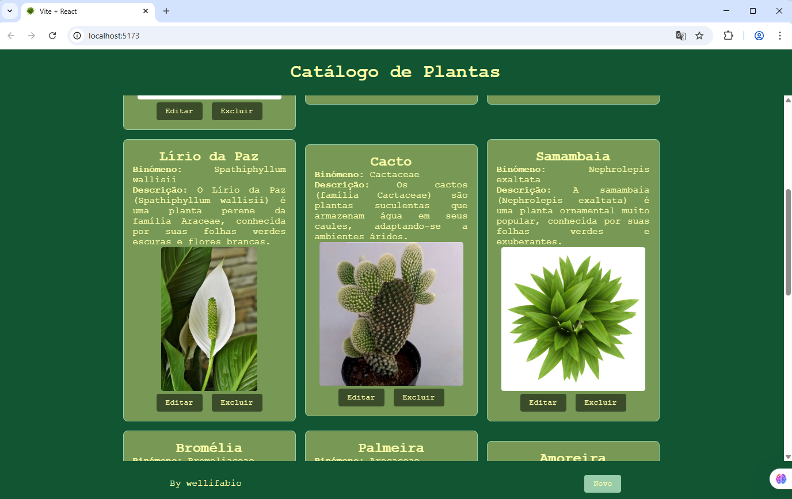
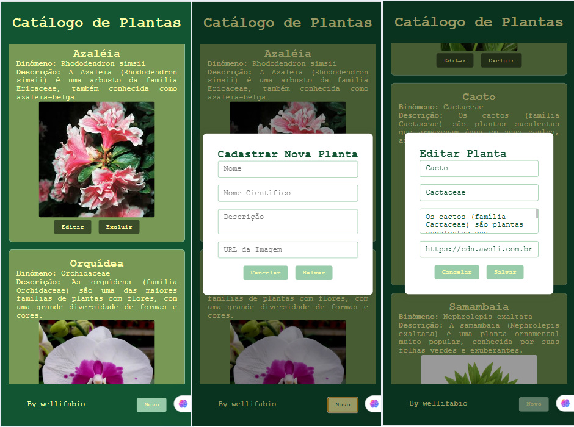

# Catálogo de plantas
Front-end simples de exemplo para cadastro de plantas.

## Tecnologias utilizadas
- React
- Vite
- Axios

## Passos para execução
1. Clone o repositório
2. Acesse a pasta `/api` e siga as instruções em README para iniciar a API
3. Acesse a pasta `/web`
4. Instale as dependências com `npm install`
5. Inicie o aplicativo com `npm run dev`

## Screenshots

